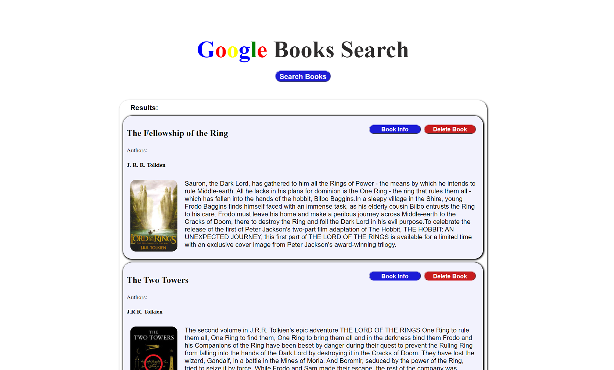

# Google Books Search


## Description

Google Books Search is a React app that uses the Google Books API to display book information from a user query. The books can then be saved and deleted using MongoDB.

### _Visit this website by clicking the link below_
[Google Books Search](https://google-books-search-117.herokuapp.com/)



## Table of Contents 

* [Installation](#installation)

* [Usage](#usage)

* [License](#license)

* [Contribution Guidelines](#contribution-guidelines)

* [Tests](#tests)

* [Questions](#questions)

## Installation

Run the following command to install dependencies:

```
npm install
```

## Usage

From the home page, choose to navigate to the 'saved books' page or the 'search books' page. On the 'search' page a user can enter in the name of a book or collection of books to search for. The data collected from the Google Books API will then be displayed below in a results container. Each search result has the option to be saved or viewed on a google search page. All saved books will be stored in a Mongo database and can be viewed on the 'saved books' page. Here, a user can view the databases saved books and decide to navigate to a google search page with the book parameters, or delete the book from the database.

## License

This project is licensed under MIT

## Contribution Guidelines

Currently there are no contribution guidelines for this repo.

## Tests

Run the following command in the terminal to run tests:

```
no tests currently for this repo
```

## Questions

If you have any questions regarding this repo, you may contact me at tniles320@gmail.com. To see my other work, follow this link: [GitHub](https://github.com/tniles320/).